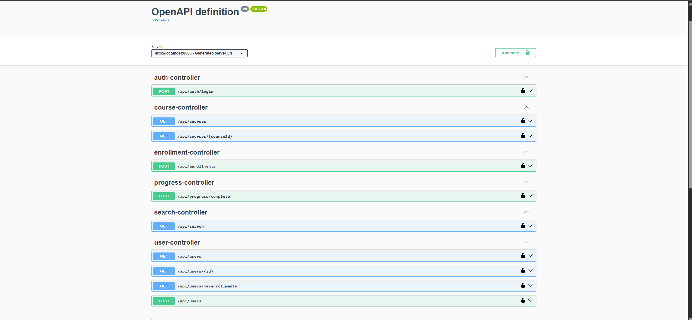
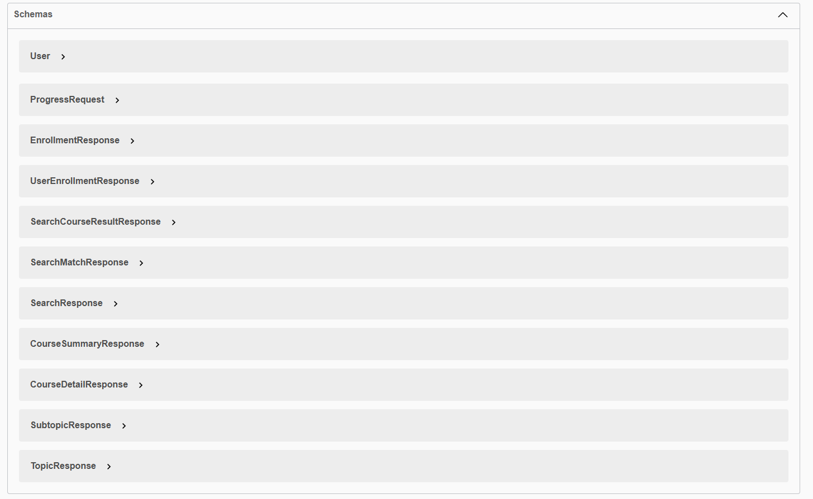

# 📚 EduSphere — Full-Stack Course Platform

EduSphere is a **production-grade full-stack learning platform** built with Spring Boot and React.

It showcases secure REST API design, role-based access control, JWT authentication, course delivery workflows, database integration, and deployment-ready architecture.

🔗 **Live API:** https://your-deployed-link-here  
🔗 **Swagger Docs:** https://your-deployed-link-here/swagger-ui.html

---

## 🚀 Tech Stack

- **Java 17**
- **Spring Boot 3**
- **Spring Security + JWT Authentication**
- **Role-Based Authorization (USER / ADMIN)**
- **Spring Data JPA (Hibernate)**
- **PostgreSQL (Render Deployment)**
- **H2 Database (Local Development)**
- **Swagger / OpenAPI Documentation**
- **Docker Support**
- **Maven**

---

## 🔐 Authentication & Security

This API uses **JWT-based authentication**.

### Roles Implemented:
| Role | Access |
|------|--------|
| USER | Browse courses, enroll, track progress |
| ADMIN | Create courses and manage platform |

### Security Features
- Password hashing using **BCrypt**
- Stateless JWT authentication
- Role-based route protection
- Global exception handling (no stack traces exposed)
- Input validation

---

## 📦 API Features Implemented

### 👤 Authentication
- Register user  
- Login user (returns JWT)  
- Role stored inside JWT  

### 📚 Courses
- View all courses (summary)
- View full course structure (topics + subtopics)

### 🎓 Enrollment
- Enroll logged-in user in a course
- Prevent duplicate enrollments
- View user dashboard enrollments

### 📖 Progress Tracking
- Mark subtopics as completed
- Prevent duplicate progress entries

### 🔍 Search
- Search within course subtopics
- Returns grouped course-level matches with snippets

### 👑 Admin Features
- Create new courses (ADMIN only)

---

## 🧠 Architecture Highlights

- DTO-based response design
- Clean service-layer architecture
- Custom exception handling with proper HTTP status codes
- Validation using `@Valid`
- Separation of concerns (Controller / Service / Repository)
- JWT filter for authentication context injection

---

## ⚙️ Local Setup Instructions

### 1️⃣ Clone the Repository

```bash
git clone https://github.com/yourusername/course-platform-api.git
cd course-platform-api
mvn spring-boot:run -Dspring-boot.run.profiles=local
```

http://localhost:8080/swagger-ui.html

```bash 
docker-compose up --build
``` 
## 🚀 Deployment

The application is deployed with:

- Managed PostgreSQL on Render
- Environment-based database and JWT configuration
- Production-ready application settings for cloud hosting

## 🧪 Testing Strategy

- Validation errors return structured responses
- Authentication and role restrictions are testable through Swagger
- Edge cases are handled with custom exceptions and consistent status codes

## 💡 Product Approach

This project was shaped as a real platform rather than a basic CRUD exercise. Security, clean service boundaries, scalable API design, and deployability were treated as first-class concerns.

### Key Decisions

- JWT over server sessions for stateless scalability
- Role claims inside the token for efficient authorization checks
- DTOs to avoid direct entity exposure
- Global exception handling for consistent API responses

📸 API Screenshots






## 👨‍💻 Author

Jayant Sharma  
Backend Developer (Spring Boot)
